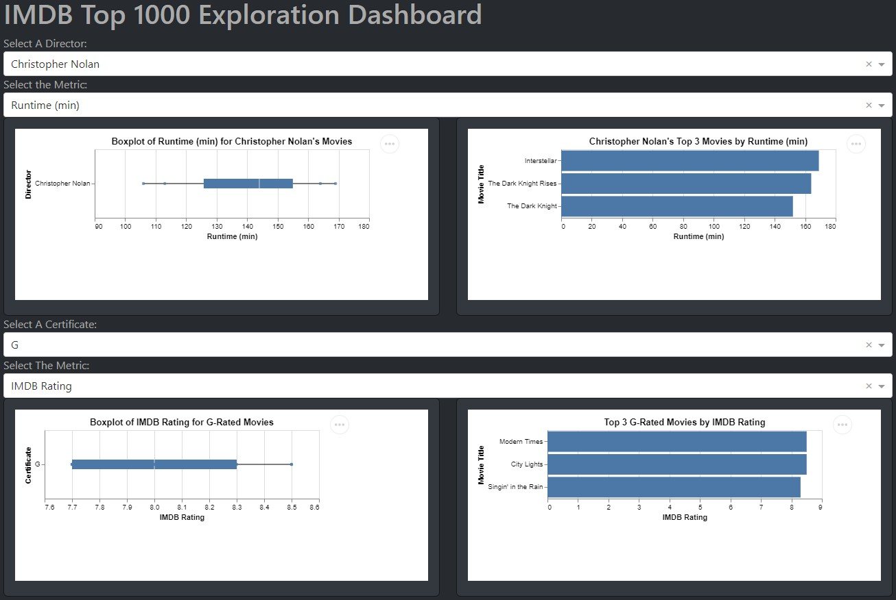

# IMDB_Viz_Dash_App

Welcome everyone and thank you for visiting the `IMDB_VIZ_Dash_App` project repository!

If you love great movies and need some help figuring out which one to watch next, then you've come to the right place as our app is exactly what you need!

[Link to the IMDB_VIZ_Dash App via Render](https://arjunrk.shinyapps.io/IMDB_Viz_R/)

To read more about our wonderful app, feel free to jump over to one of the sections below or continue scrolling down.

- [Motivation and Purpose](#motivation-and-purpose)
- [Usage](#usage)
- [Installation](#installation)
- [Contributing](#contributing)
- [Description of the Data](#description-of-the-data)
- [License](#license)

## Motivation and Purpose

Choosing a good movie to watch can be a struggle sometimes and there's almost nothing worse than realizing you just spent 2 hours sitting through a horrible movie that you didn't enjoy one bit. Our user-friendly and accessible dashboard aims to help movie enthusiasts avoid this problem by helping them discover and explore new movies based on their movie watching preferences. In addition, our dashboard uses a vast database of movies to provide users with information on ratings, runtimes, and gross revenues presented through engaging visuals based on various metrics they can select via an interactive and intuitive interface.  This dash app was developed as a secondary companion to our original shiny app to allow users to further explore their movie interests.  Please refer to the [Proposal](https://github.com/UBC-MDS/IMDB_Viz_R/blob/main/reports/proposal.md) of our original app for more information and be sure to visit our [shiny app](https://arjunrk.shinyapps.io/IMDB_Viz_R/) as well.  In this dash version of our app I chose to focus more on some of the unused variables from our original app, such as `Director` and `Certificate`, and allow users to pick which numeric variable to visualize as a distribution and receive recommendations for based on these two categorical variables.

## Usage

This dashboard includes interactive plots for users to easily visualize the distributions of five different numeric variables (`Runtime (min)`, `IMDB Rating`, `Meta Score`, `Number of Votes`, and `Gross Revenue ($USD)`) for both a director and a certificate (i.e. movie age rating) of their choosing.  Users are also provided with the top 3 movie recommendations for the chosen director and certificate ranked according to the numeric variable they selected for the distribution.

Upon opening our app, users can use the drop down menus at the top to select a director they are interested in from the list and then the numeric variable (referred to as `metric` in the app) for which they would like to view the distribution and receive ranked movie recommendations.  The two interactive plots directly below these selections will then update and show the distribution of the selected metric for the chosen director as a boxplot and the top 3 movie recommendations ranked according to the selected metric as a horizontal bar plot.  

Users can then move on to the second set of drop down menus in the middle of the app to select a certificate they would like to view from the list and then the metric for which they would like to view the distribution and receive more ranked movie recommendations.  As with the director plots, the two interactive plots directly below these slections will then update and show the distribution of the selected metric for the chosen certificate as a boxplot and the top 3 movie recommendations ranked according to the selected metric as a horizontal bar plot.  

Additionally, all four of these interactive plots also include tooltips, so users can hover over the boxplots to see more detailed information regarding the distribution (i.e. min, Q1, median, Q3, max) and over the bar plots to see the actual value of the ranking metric for each of the top 3 movies.  Thus, with our app, movie lovers can explore various metrics for their favorite directors and preferred certificates all while receiving some recommendations of movies to watch once they are done exploring.

## Installation

To start off, fork the repo from <https://github.com/mikeguron/IMDB_Viz_Dash_App> and clone the forked repo to your local machine in [VScode](https://code.visualstudio.com/download) by running:

`git clone https://github.com/[Your-GitHub-Page]/IMDB_Viz_Dash_App.git`

Navigate to the folder and run the following in terminal to create and activate the conda environment:

`conda env create --file dataviz-532.yaml`

`conda activate dataviz-532`

In the root directory of the IMDB_Viz_Dash_App folder, run the following to change to the appropriate directory and deploy the app locally:

`cd src`

`python app.py`

## Contributing

Interested in contributing? Check out the [contributing guidelines](https://github.com/mikeguron/IMDB_Viz_Dash_App/blob/main/CONTRIBUTING.md). Please note that this project is released with a [Code of Conduct](https://github.com/mikeguron/IMDB_Viz_Dash_App/blob/main/CODE_OF_CONDUCT.md). By contributing to this project, you agree to abide by its terms.

## Description of the Data

For the dashboard, we're sourcing the data from Kaggle, which is a well-known platform for data science and machine learning projects. It can be accessed [here](https://www.kaggle.com/datasets/harshitshankhdhar/imdb-dataset-of-top-1000-movies-and-tv-shows). The dataset contains 1000 observations of movie data with a compressive set of features. Some of the key features are the movie's title (Series_Title), the certificate issued (Certificate), release year (Released_Year), runtime (Runtime), genre (Genre), IMDB rating (IMDB_Rating), meta score (Meta_score), director (Director), star power (Star1, Star2, Star3, Star4), number of votes (No_of_votes), and box office earnings (Gross). The dataset also contains a summary of the movie (Overview) which allows the users to quickly understand if the story is something they would prefer or not. For this dash app version, I only extracted movies with no null values and selected title, director, certificate, and the five numerical columns.

## License

`IMDB_Viz_Dash_App` was created by Mike Guron. It is licensed under the terms of the MIT license.